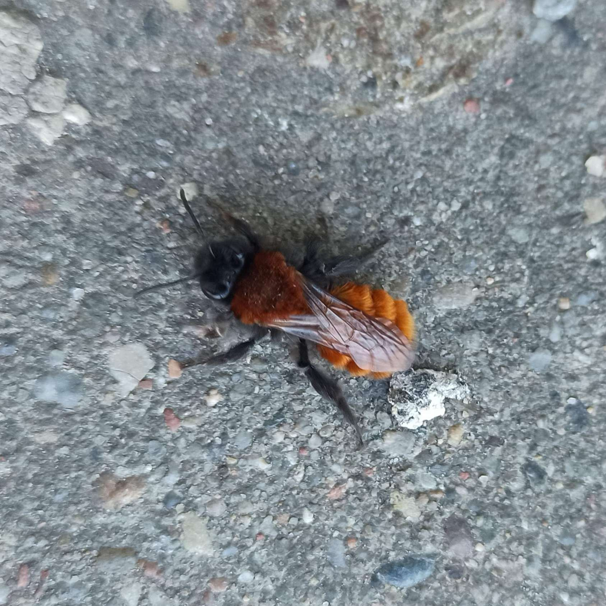

# Hi, I'm Wafkl 👋

Bioinformatics graduate digging into Python development. I enjoy exploring intersections of disciplines and documenting urban wildlife.

  

My code varies from applying numerical methods and multi-dimensional data analysis to modelling stochastical processes. Looking for a place where I could grow my skills by solving practical problems. 

---

## 🛠️ Tech & Tools

**Languages**
- Python
- SQL

**Data & ML**
- NumPy, Pandas, Polars
- scikit-learn
- Statsmodels
- OpenCV
- Matplotlib

**Backend**
- FastAPI
- PostgreSQL
- gRPC
- REST APIs

**Other**
- Git
- Jupyter Notebook
- Linux

---

## 🚀 Selected Projects

---

### 🌻 Flower Classifier

Machine learning pipeline for recognizing flower species from images.

- Built an SVM classifier with PCA dimensionality reduction
- Applied GridSearchCV for hyperparameter optimization
- Implemented reusable training, prediction, saving and loading workflow
- Processed 4,317 images across 5 classes

**Stack:** Python · scikit-learn · OpenCV · NumPy · Pandas · Matplotlib · Seaborn

---
### 🔌 Anita — Backend Application

Backend service combining REST API, database integration and CLI communication.

*Academic project developed within the Faculty of Biotechnology. The repository is private due to course requirements.*

- Built REST API endpoints using FastAPI and uvicorn
- Integrated PostgreSQL database using psycopg2
- Implemented gRPC communication between services
- Developed data processing workflows with Pandas

**Stack:** Python · FastAPI · PostgreSQL · psycopg2 · gRPC · uvicorn · Pandas

---

### 📊 PCA Analysis Toolkit

CLI tool for Principal Component Analysis on multivariate datasets.

- Implemented complete PCA workflow: autoscaling, covariance matrix, eigenvalue decomposition and factor loadings
- Created configurable command-line interface using argparse
- Generates scree plots, explained variance charts and factor loading visualizations
- Exports intermediate analysis results to Excel

**Stack:** Python · NumPy · Pandas · SciPy · Matplotlib · Seaborn · argparse · openpyxl

---

### 🎲 Stochastic Process Simulations

Collection of Monte Carlo simulations exploring probabilistic models.

- Simulated population dynamics with genetic drift
- Compared neutral drift and fitness advantage scenarios
- Implemented site percolation model with BFS-based path detection
- Estimated percolation threshold through repeated simulations

**Stack:** Python · NumPy · Matplotlib · Jupyter Notebook · SciPy

## 📫 Contact

· [splendid.well@proton.me]
